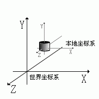
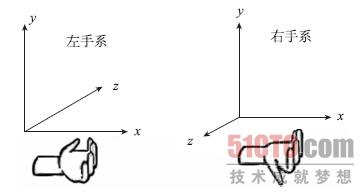
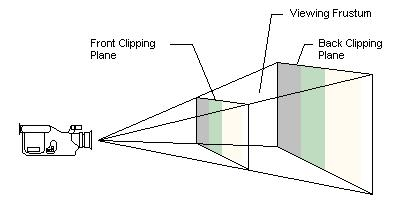
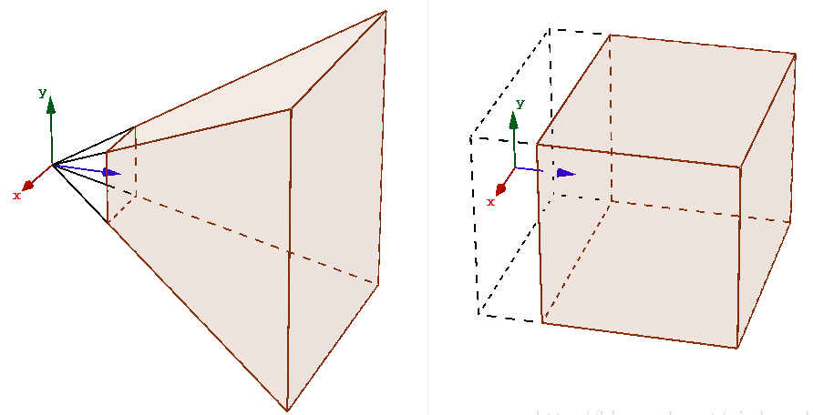
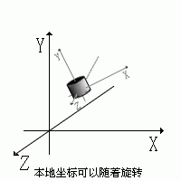
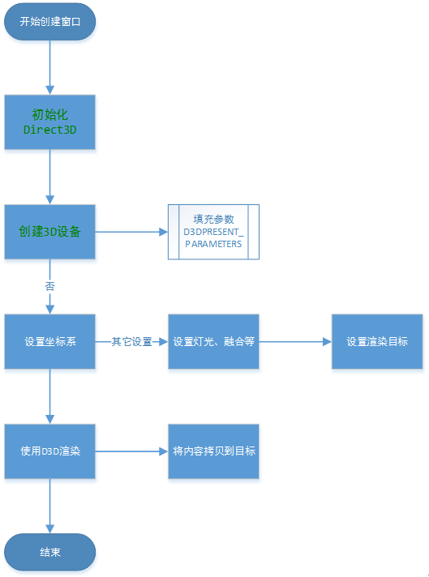

# D3D学习DX渲染

## 一、基本概念
### 1. 世界坐标系（D3DTS_WORLD）
所谓世界坐标系就是将所有物件投射到同一个坐标系的坐标系，对于屏幕上的所有物体来说，这个坐标系系统都是相同的并且不会改变。用户默认的观察视角 X轴水平向右，Y轴垂直向上，Z轴指向用户。  

>左手坐标系和右手坐标系(Left-handed Coordinate And Right-handed Coordinate)  
   左手坐标系：左手握拳，沿X轴正方向到Y轴正方向握紧，大拇指方向与Z轴正方向一致的坐标系称为左手坐标系。  
   右手坐标系：右手握拳，沿X轴正方向到Y轴正方向握紧，大拇指方向与Z轴正方向一致的坐标系称为右手坐标系。  


### 2. 摄影坐标系（D3DTS_VIEW）
三维世界坐标系转换到屏幕二维坐标系，摆放虚拟摄影机生成与当前角度相符的图像，此时使用的坐标系为摄影坐标系。
摄影坐标系是以虚拟摄影机的位置为坐标原点，虚拟摄影机的观察方向作为坐标轴，现实物体的坐标称为射影坐标，从世界坐标到摄影坐标的转换过程称为取景变换。

### 3. 剪裁和透视投影（D3DTS_PROJECTION）
剪裁过程会将摄影机覆盖不到的物体的部分剪裁掉。  
经过剪裁，拍摄完三维场景后，物体的坐标就从世界坐标转换为摄影坐标，下一步就是将三维物体的取景投影到二维表面上，即将当前三维的摄影坐标投影到二维坐标，此过程类似于拍照过程中胶片的曝光过程，称为透视投影变换。
   
透视投影矩阵(PerspectiveProjectionMatrix)和正交投影矩阵(OrthoProjectionMatrix)。   


### 4. SetTransform
DirectX Graphics渲染3D图像时，只需要设置好顶点变换矩阵和视口信息，就可以进行图像顶点的坐标变换  
```c
HRESULT SetTransform(
D3DTRANSFORMSTATETYPE State,	//指定要设置的变换矩阵类型
CONST D3DMATRIX *pMatrix);	//要设置的变换矩阵
```
### 5. 本地坐标系
所谓本地坐标系，就是坐标系以物体的中心为坐标原点，物体旋转、平移等操作都是围绕本地坐标系进行的。这时当物体模型进行旋转、平移等操作时，本地坐标系也执行相应的旋转、平移等操作。  
本地坐标系是一个假想的坐标系，该坐标系与物体的相对位置至始至终是不变的，假想出这个坐标系的目的主要是为了正向理解对三维场景中物体执行的平移和旋转操作。使用本地坐标系理解模型变换时，所有的变换操作直接作用与本地坐标系，由于本地坐标系与物体的相对位置不变，因此对本地坐标系进行平移、旋转和缩放时，物体在场景中位置和形状也会发生相应的变化。   


## 二、环境配置
1.	安装DXSDK_Jun10.exe
2.	安装 visual studio

## 三、基本应用流程图


## 四、基本应用架构实现及分析
### 1.	初始化Direct3D
IDirect3D9 *WINAPI Direct3DCreate9(UINT SDKVersion);
SDKVersion参数值必须设置为D3D_SDK_VERSION,如果创建成功，返回指向IDirect3D9接口的指针，否则返回NULL指针。
```c
// 初始化 Direct3D 
	if((IDirect3D9 *pD3D = Direct3DCreate9(D3D_SDK_VERSION)) == NULL)
		return E_FAIL;
```
### 2.	填充参数
通过IDirect3D9接口对象的GetAdapterDisplayMode()函数获取适配器的当前显示模式
```c
	D3DDISPLAYMODE d3ddm;
	pD3D->GetAdapterDisplayMode(D3DADAPTER_DEFAULT, &d3ddm);

	d3dpp.BackBufferWidth  = DesiredWidth;
	d3dpp.BackBufferHeight = DesiredHeight;
	d3dpp.BackBufferFormat = D3DFMT_A8R8G8B8; //d3ddm.Format;
	d3dpp.BackBufferCount  = 1;
	d3dpp.SwapEffect       = D3DSWAPEFFECT_DISCARD;
	d3dpp.Windowed         = TRUE;
	d3dpp.EnableAutoDepthStencil = TRUE;
	d3dpp.AutoDepthStencilFormat = D3DFMT_D24S8;
	d3dpp.FullScreen_RefreshRateInHz = D3DPRESENT_RATE_DEFAULT;
	d3dpp.PresentationInterval       = D3DPRESENT_INTERVAL_IMMEDIATE;
```
### 3.	检测顶点计算
判断当前显卡是否支持3D顶点的硬件渲染，从而确定应该使用硬件抽象层HAL的哪种方式。IDirect3D9接口对象提供GetDeviceCaps()函数实现显卡的功能检测。  
相关接口说明：  
```c
HRESULT GetDeviceCaps(
UINT Adapter,          //指定要获取功能信息的显卡适配器的原始编号
D3DDEVTYPE DeviceType, //指定要获取功能信息的设备的类型
D3DCAPS9 *pCaps);     //指定存放设备功能信息的D3DCAPS9结构指针
如果函数成功，返回D3D_OK,如果失败，返回值
D3DERR_INVALIDCALL：方法调用无效
D3DERR_INVALIDDEVICE：请求设备类型无效
D3DERR_OUTOFVIDEOMEMORY：没有足够显存来完成操作
```
相关代码示例：  
```c
// 检测顶点运算
	D3DCAPS9 caps;
	pD3D->GetDeviceCaps(D3DADAPTER_DEFAULT, D3DDEVTYPE_HAL, &caps);
	DWORD Flags = 0;
	if (caps.DevCaps & D3DDEVCAPS_HWTRANSFORMANDLIGHT)
	{
		Flags = D3DCREATE_HARDWARE_VERTEXPROCESSING | D3DCREATE_PUREDEVICE | D3DCREATE_NOWINDOWCHANGES;
	}
	else
	{
		Flags = D3DCREATE_SOFTWARE_VERTEXPROCESSING | D3DCREATE_NOWINDOWCHANGES;
	}
	// 多线程
	if(MultiThreaded == TRUE)
		Flags |= D3DCREATE_MULTITHREADED;

```

### 4.	创建3D设备
通过IDirect3D9接口对象的CreateDevice()函数创建代表显示适配器的设备。  
相关接口说明：  
```c
HRESULT CreateDeveice(
UINT Adapter,			//指定要获取当前显示模式的适配器的编号
D3DDEVTYPE DeveiceType,//表示要创建的设备的类型
HWND hFocusWindow,	//程序从前台切换到后台的通知对话框
DWORD BehaviorFlags,	//指定创建设备的选项
D3DPRESENT_PARAMMETERS *pPresentationParameters,	//指向D3DPRESENT_PARAMETERS结构的指针
IDirect3DDevice9 **ppReturnedDeviceInterface	//创建后返回的IDirect3DDevice9接口指针
);
```
相关代码示例：  
```c
// 创建3D设备 
	if(FAILED(hr = pD3D->CreateDevice(
		D3DADAPTER_DEFAULT, 
		D3DDEVTYPE_HAL, hWnd, Flags, 
		&d3dpp, &pD3DDevice)))
		return hr;
```

### 5. 设置坐标系
1)	世界坐标
```c
	//	Y轴旋转
	D3DXMATRIXA16 matWorld;
	UINT  iTime = timeGetTime() % 1000;
	FLOAT fAngle = iTime * (2.0f * D3DX_PI) / 1000.0f;
	D3DXMatrixRotationY(&matWorld, fAngle);
	pD3DDevice->SetTransform(D3DTS_WORLD, &matWorld);
```
2)	摄像机坐标
```c
	// 设置观察变换矩阵
	float xStart = width / 2.0f;
	float yStart = height / 2.0f;

	D3DXVECTOR3 pos(xStart, yStart, 100.0f);
	D3DXVECTOR3 target(xStart, yStart, 0.0f);
	D3DXVECTOR3 up(0.0f, -1.0f, 0.0f);
	D3DXMATRIX matView;
	D3DXMatrixLookAtLH(&matView, &pos, &target, &up);
	pD3DDevice->SetTransform(D3DTS_VIEW, &matView);
```
3)	投影矩阵
```c
a)	透视
	//投影变换  
	D3DXMATRIX proj;
	D3DXMatrixPerspectiveFovLH(
			&proj,
			D3DX_PI / 4.0f,
			(float)width / (float)height,
			1.0f,
			1000.0f);
	pD3DDevice->SetTransform(D3DTS_PROJECTION, &proj);

b)	正交
	// 设置正交投影矩阵
	D3DXMATRIX matProject;
	D3DXMatrixOrthoLH(&matProject, width, height, 0, 100);
	pD3DDevice->SetTransform(D3DTS_PROJECTION, &matProject);
```

### 6. 使用DX渲染
1)	调用IDirect3DDevice9设备对象的Clear()函数，清空元素，可以清除一个或多个表面。
```c
HRESULT Clear(
DWORD Count,		//指定pRects参数中要清空元素的矩形个数
CONST D3DRECT * pRects,	//用于存储要清空元素的矩形
DWORD Flags,		//一个或多个D3DCLEAR标记的组合，用于指定要清除的类型
D3DCOLOR Color,	//指定用于清空渲染目标所使用的ARGB颜色值
float Z,				//指定使用新的z值来清空深度缓存，其值得范围为0~1
DWORD Stencil);		//指定使用信息清空模板缓存
```
2)	调用IDirect3Device9设备对象的BeginScene()函数，启动场景的绘制
```c
HRESULT BeginScene();
```
3)	绘制完毕，调用IDrect3DDevice9设备对象的EndScene()函数，结束场景绘制
```c
g_pD3DDevice->Clear(0, NULL, D3DCLEAR_TARGET | D3DCLEAR_ZBUFFER, D3DCOLOR_RGBA(0, 0, 0, 0), 1.0f, 0);
	if (SUCCEEDED(g_pD3DDevice->BeginScene()))
	{
		Draw();
		g_pD3DDevice->EndScene();
	}
	g_pD3DDevice->Present(NULL, NULL, NULL, NULL);
```

## 五、	窗口透明处理
1.	设置渲染目标
```c
if (FAILED(g_pD3DDevice->CreateRenderTarget(WIDTH, HEIGHT,
		D3DFMT_A8R8G8B8, D3DMULTISAMPLE_NONE, 0,
		/*!g_is9Ex*/false, // lockable
		&g_pd3dSurface, NULL)))
	{
		return;
	}
	g_pD3DDevice->SetRenderTarget(0, g_pd3dSurface);
	g_dcSurface.Create(WIDTH, HEIGHT);
	SetWindowLong(g_hWnd, GWL_EXSTYLE, (GetWindowLong(g_hWnd, GWL_EXSTYLE) & ~WS_EX_TRANSPARENT) | WS_EX_LAYERED);
```
2.	将结果绘制到目标窗口
```c
D3DLOCKED_RECT	lockedRect;
	RECT rc, rcSurface = {0, 0, WIDTH, HEIGHT};
	::GetWindowRect(g_hWnd, &rc);
	POINT ptWinPos = { rc.left, rc.top};
	POINT ptSrc = { 0, 0};
	SIZE szWin = { WIDTH, HEIGHT };
	BLENDFUNCTION stBlend = { AC_SRC_OVER, 0, 255, AC_SRC_ALPHA };
	HDC		hdcWnd = GetWindowDC(g_hWnd);
	
g_pD3DDevice->CreateOffscreenPlainSurface(WIDTH, HEIGHT, 
	  		D3DFMT_A8R8G8B8, D3DPOOL_SYSTEMMEM, &g_psysSurface, NULL);
	g_pD3DDevice->GetRenderTargetData(g_pd3dSurface, g_psysSurface);
	g_psysSurface->LockRect(&lockedRect, &rcSurface, D3DLOCK_READONLY);
	memcpy(g_dcSurface.GetBits(), lockedRect.pBits, 4 * WIDTH * HEIGHT);
UpdateLayeredWindow(g_hWnd, hdcWnd, &ptWinPos, &szWin, g_dcSurface.GetSafeHdc(), &ptSrc, 0, &stBlend, ULW_ALPHA);
	g_psysSurface->UnlockRect();
```

## 六、	简单绘制图片
### 1.	创建缓冲顶点
创建存储要绘制的三角形面上的顶点数据的缓冲区  
调用IDrect3DDeveice9设备对象的CreateVertexBuffer函数创建顶点缓冲区对象IDirect3DVertexBuffer9。  
```c
HRESULT CreateVertexBuffer(
UINT Length,		//指定顶点缓冲区的大小，单位是字节
DWORD Usage,		//表示缓冲区的用途
DWORD FVF,		//D3DFVF顶点格式常数的组合
D3DPOOL Pool,		//资源中有效的内存类型
IDirect3DVertexBuffer9** ppVertexBuffer,		//指向IDirect3DVertexBuffer9接口类型的指针，表示创建的顶点缓冲区资源
HANDLE* pSheareadHandle);	//预留
```
```c
//顶点结构  
struct VERTEX
{
	float _x, _y, _z; // 位置  
	float _u, _v;      //纹理坐标  
	VERTEX() {}
	VERTEX(float x, float y, float z, float u, float v)
		:_x(x), _y(y), _z(z), _u(u), _v(v) {}
};

// create vertex buffer
if (FAILED(g_pD3DDevice->CreateVertexBuffer(6 * sizeof(VERTEX),
			0, D3DFVF_XYZ | D3DFVF_DIFFUSE, D3DPOOL_DEFAULT, &m_pVB, NULL)))
{
	return;
}
```
### 2.	锁定顶点内存
调用IDirect3DVertexBuffer9对象的Lock()函数，锁定指定范围的顶点数据，并返回顶点缓冲区内存的指针  
```c
HRESULT Lock(
UINT OffsetToLock,//要锁定的顶点数据的偏移量，单位是字节
UINT SizeToLock,//指定要锁定的顶点数据的大小，单位是字节
VOID **ppbData,//包含返回的顶点数据的内存缓冲区的指针
DWORD Flags);//锁定缓冲区的选项
```
```c
// lock vertex buffer
VERTEX* pVertices;
if (FAILED(m_pVB->Lock(0, 0, (void**)&pVertices, 0)))
{
	return;
}
```

### 3.	创建及拷贝内存数据
使用内存数据复制函数，将顶点数据复制到锁定的顶点数据缓冲区指针指向的内存区域中  
```c
VERTEX verts[] = {
		{ (float)rc.left, (float)rc.top, 0.0f, 0.0f, 0.0f },
		{ (float)rc.right, (float)rc.bottom, 0.0f, 1.0f, 1.0f },
		{ (float)rc.left, (float)rc.bottom, 0.0f, 0.0f, 1.0f },
		{ (float)rc.right, (float)rc.bottom, 0.0f, 1.0f, 1.0f },
		{ (float)rc.left, (float)rc.top, 0.0f, 0.0f, 0.0f },
		{ (float)rc.right, (float)rc.top, 0.0f, 1.0f, 0.0f }
	};
	memcpy(pVertices, verts, sizeof(verts));
```
### 4.	解锁
调用IDirect3DVertexBuffer9对象的Unlock()函数，解锁对顶点数据缓冲区的锁定  
HRESULT Unlock();
```c
m_pVB->Unlock();
```
### 5.	将数据绑定到设备
调用IDirect3DDeveice9设备对象的SetStreamSource()函数，将顶点缓冲区绑定到设备数据流中  
```c
HRESULT SetStreamSource(
UINT StreamNumber,		//指定数据流，其范围从0到设备最大的流数目
IDirect3DVertexBuffer9 *pStreamData,	//指向IDirect3DVertexBuffer9接口的指针，表示要绑定到设备数据流的顶点缓冲区对象
UINT offsetInBytes,		//表示要绑定的顶点数据开始的偏移量，单位是字节
UINT Stride);			//表示顶点数据的大小
```
```c
g_pD3DDevice->SetStreamSource(0, m_pVB, 0, sizeof(VERTEX));
```
### 6.	设置顶点数据类型
调用IDirect3DDevice9设备对象的SetFVF()函数，设置当前的顶点流中的顶点数据类型。  
HRESULT SetFVF(DWORD FVF);
```c
#define FVF_VERTEX (D3DFVF_XYZ  | D3DFVF_TEX1)  
g_pD3DDevice->SetFVF(FVF_VERTEX);
```
### 7.	创建及设置纹理
通过IDirect3D9接口对象的D3DXCreateTextureFromFile()函数创建一张图片纹理。  
D3DXCreateTextureFromFile(g_pD3DDevice, szFxFileName, &pTexture);
```c
	g_pD3DDevice->SetTexture(0, pTexture);
```
### 8.	绘制图片
调用IDirect3Device9设备对象的DrawPrimitive函数，绘制图元。  
```c
HRESULT DrawPrimitive(
D3DPRIMITIVETYPE PrimitiveType,//要渲染的图元的类型
UINT StartVertex,	//要载入的第一个顶点的索引
UINT PrimitiveCount	//要渲染的顶点数目
);
```
```c
	//绘制 
	g_pD3DDevice->DrawPrimitive(D3DPT_TRIANGLELIST, 0, 2);
	//释放
	g_pD3DDevice->SetTexture(0, NULL);
```
## 七、	简单使用ID3dXSprite播放SVGA
ID3DXSprite是DriectX 9.0里面的一个简单模块，提供了一系列函数帮助程序员使用D3D渲染2D精灵。在DriectX 9.0帮助文档里面对其功能的描术为：“向用户提供一套简单的在屏幕上实现精灵渲染的接口。”何为精灵渲染，说白了就是渲染2D画面，ID3DXSprite帮助用户透过简单的操作就能运用DriectX 9.0制作2D游戏（渲染2D图形）    
ID3DXSprite接口是微软为了帮助程序员轻松实现2D游戏而准备的，所以，在使用ID3DXSprite接口时，不需要由程序员建立投影坐标系、观察坐标系，也不需要创建顶点缓冲及定义顶点数据结构和灵活顶点格式。    
### 1.	使用ID3DXSprite接口的典型步骤是：
1)	通过D3DXCreateSprite函数得到指向ID3DXSprite接口的指针  
2)	调用ID3DXSprite::Begin函数准备渲染状态  
3)	调用ID3DXSprite::SetTransform函数设置精灵的世界坐标系变换（包括缩放、旋转和平移）  
4)	调用ID3DXSprite::Draw函数将精灵显示在屏幕上  

### 2.	创建D3DXSprite对象
要使用ID3DXSpirte，首先需要使用D3DXCreateSprite函数创建D3DXSprite对象。D3DXCreateSprite函数将使用当前的3D设备，创建一个Sprite对象，并返回指向这个Sprite对象的指针。其函数原型如下：
```c
HRESULT D3DXCreateSprite(   
  LPDIRECT3DDEVICE9 pDevice,   
  LPD3DXSPRITE * ppSprite    
);  
```

### 3.	准备渲染状态
用ID3DXSprite接口，可以通过调用Beign函数来设置渲染状态。Begin函数的原型如下：  
```c
HRESULT Begin(
  DWORD Flags
);
```
最常用的参数是D3DXSPRITE_ALPHABLEND，它表示将要打开Alpha混合开关，实现精灵的透明渲染。在3D游戏中常用到D3DXSPRITE_ALPHABLEND |D3DXSPRITE_BILLBOARD这两个值的组合来实现粒子系统。

### 4.	设置精灵的世界坐标系变换
世界变换包括了缩放、旋转、平移等操作。对于这些操作，可以使用D3DXMatrixScaling函数、D3DXMatrixTranslation函数、D3DXMatrixRotationZ计算出相应的变换矩阵，再用D3DXMatrixMultiply函数按一定的变换顺序将它们累积起来。然后使用D3DXSprite对象的SetTransform函数设置精灵的世界变换。

### 5.	在屏幕指定位置渲染
使用D3DXSprite对象渲染时，其坐标系是以屏幕左上角为坐标原点，沿原点向左是X坐标增大的方向，沿原点向下是y坐标增大的方向。  
D3DXSprite的绘图操作必须放在D3DXSprite对象的Begin()/End()函数对之间完成。在调用其Begin函数时可以同时指定精灵渲染时的行为（比如打开Alpha混合开关），而具体的操作则交给Draw函数来完成。
### 6.	渲染完成
Begin函数应该和End函数成对出现，渲染的操作应该放在Being函数和End函数之间。End函数原型如下：
```c
HRESULT End();
```
通过End函数调用，D3D设备会将渲染的内容提交给设备显示出来。值得注意的是，ID3DXSprite接口提供的Begin/End函数并不能取代BeginSecne/EndScene函数，而是应该放在它们之间

### 7.	实现代码
```c
// Sprite绘制开始
	g_pSprite->Begin(D3DXSPRITE_ALPHABLEND);

	for (std::list<SvgaMsg>::iterator it = g_listSvgaMsg.begin(); it != g_listSvgaMsg.end(); ++it)
	{ 
		SvgaMsg& svgaMsg = *it; 
		// get image 
		CTexture2D* pTexture = getTexture2D(svgaMsg.imageName);
		if (pTexture)
		{
			SvgaFrame& svgaFrame = svgaMsg.frames[m_index]; 
			// 矩阵变化
			g_pSprite->SetTransform(&svgaFrame.mat);
			g_pSprite->Draw(pTexture->GetTexture(), NULL, NULL, NULL, svgaFrame.color);//0x99ffffff为透明度值，不透明到完全透明的取值范围：0xffffffff~~0x00ffffff
		}
	}
	 
	// Sprite绘制结束
	g_pSprite->End();
```


