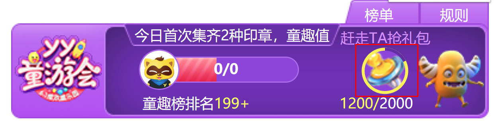

# vue组件在活动需求中的开发技巧
总体来说：一般的活动一般分为任务条和榜单：
任务条的位置一般是视频下方或者中屏右下角，是CefWebWidget，是控件；
榜单（弹窗），是一个弹出窗口CefCocosPopWnd，可以在任何位置，如果要跟随窗口移动就要加上entTemplate.keepWndPos属性；
下面具体介绍开发技巧：

## 1. v-if 和 v-show
	由于v-if在条件不成立时候是不会创建出来的，所以一些在js里面用到的根据div或者id查找元素的组件会报错
	例如：svga、qrcode等。
	解决办法：把v-if换成v-show


## 2. 圆形进度条



```html
<svg viewBox="0 0 200 200" :width="40" :height="40">
    <circle cx="100" cy="100" :r="90" fill="none" stroke="#fdec47" :stroke-width="15" :stroke-dasharray="dashLen" :stroke-dashoffset="dashLen_per" transform="rotate(-90,100,100)" style="transition: stroke-dashoffset 0.4s" />
</svg>
```